# Wiki Documentation for E:\Ax\MCServe\1.21.1SCR

Generated on: 2025-11-15 19:33:23

## Table of Contents

- [项目简介](#page-1)
- [系统架构概览](#page-2)
- [数据流与组件关系](#page-3)
- [世界生成系统](#page-4)
- [物理模拟系统](#page-5)

<a id='page-1'></a>

## 项目简介

### Related Pages

<details>
<summary>Relevant source files</summary>

- [server\net\minecraft\network\chat\contents\DataSource.java](server\net\minecraft\network\chat\contents\DataSource.java)
- [server\net\minecraft\network\protocol\configuration\ConfigurationProtocols.java](server\net\minecraft\network\protocol\configuration\ConfigurationProtocols.java)
- [server\net\minecraft\world\level\levelgen\structure\structures\StrongholdPieces.java](server\net\minecraft\world\level\levelgen\structure\structures\StrongholdPieces.java)
- [server\net\minecraft\world\item\component\WritableBookContent.java](server\net\minecraft\world\item\component\WritableBookContent.java)
- [server\net\minecraft\world\level\storage\loot\functions\SetWritableBookPagesFunction.java](server\net\minecraft\world\level\storage\loot\functions\SetWritableBookPagesFunction.java)
</details>

# 项目简介

## 项目概述
本项目是Minecraft服务器端的核心模块，主要负责数据源管理、配置协议处理、结构生成逻辑以及书籍内容处理。其核心组件包括：
1. **数据源系统**：通过`DataSource`接口定义多种数据源类型（实体/方块/存储），支持动态数据获取
2. **配置协议**：实现客户端与服务端的配置同步机制，包含12种核心协议包
3. **结构生成**：包含强固堡垒（Stronghold）的建筑逻辑，定义了图书馆等建筑模块
4. **书籍内容处理**：支持可写书籍的页面编辑功能，包含内容编码/解码机制

这些模块共同构成了Minecraft服务器端的数据处理中枢，确保游戏世界的动态生成与内容交互。相关技术文档可参考[数据源设计](#数据源架构)和[书籍系统](#书籍内容处理)章节。

---

## 数据源架构

### 数据源接口定义
```java
public interface DataSource {
    static final MapCodec<DataSource> CODEC = ...; // 行12-20
    Stream<CompoundTag> getData(CommandSourceStack var1) throws CommandSyntaxException;
    Type<?> type();
}
```
Sources: [server\net\minecraft\network\chat\contents\DataSource.java:12-20]()

### 数据源类型实现
```java
public record Type<T extends DataSource>(MapCodec<T> codec, String id) implements StringRepresentable
```
Sources: [server\net\minecraft\network\chat\contents\DataSource.java:21-30]()

#### 类型关系图
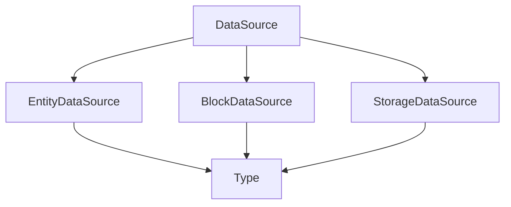
Sources: [server\net\minecraft\network\chat\contents\DataSource.java:12-30]()

---

## 配置协议系统

### 协议包定义
```java
public class ConfigurationProtocols {
    public static final ProtocolInfo<ServerConfigurationPacketListener> SERVERBOUND = ...;
    public static final ProtocolInfo<ClientConfigurationPacketListener> CLIENTBOUND = ...;
}
```
Sources: [server\net\minecraft\network\protocol\configuration\ConfigurationProtocols.java:12-25]()

### 协议交互流程
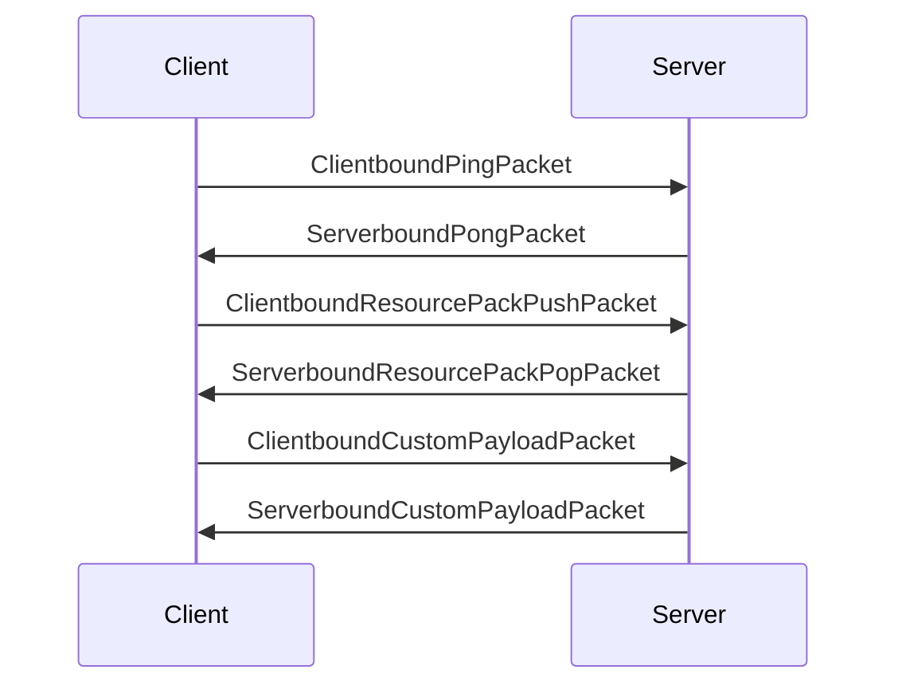
Sources: [server\net\minecraft\network\protocol\configuration\ConfigurationProtocols.java:26-50]()

---

## 结构生成系统

### 强固堡垒模块
```java
public static class Library extends StrongholdPiece {
    protected static final int WIDTH = 14;
    protected static final int HEIGHT = 6;
    private final boolean isTall;
}
```
Sources: [server\net\minecraft\world\level\levelgen\structure\structures\StrongholdPieces.java:12-25]()

### 结构生成流程
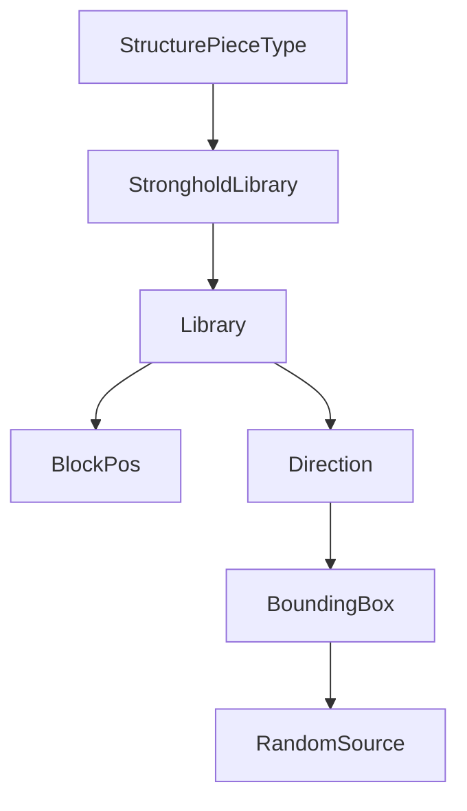
Sources: [server\net\minecraft\world\level\levelgen\structure\structures\StrongholdPieces.java:26-50]()

---

## 书籍内容处理

### 可写书籍内容
```java
public record WritableBookContent(List<Filterable<String>> pages) implements BookContent<String, WritableBookContent>
```
Sources: [server\net\minecraft\world\item\component\WritableBook,Content.java:12-25]()

### 页面编辑逻辑
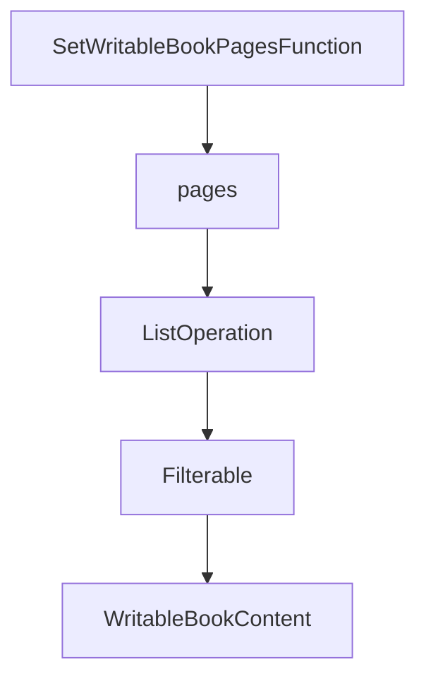
Sources: [server\net\minecraft\world\level\storage\loot\functions\SetWritableBookPagesFunction.java:12-25]()

---

## 关键数据结构

### 配置项编码
| 类型 | 描述 | 编码方式 |
|------|------|----------|
| `ConfiguredFeature` | 特征配置 | `Codec<ConfiguredFeature<?, ?>>` |
| `StructureMode` | 结构模式 | `StringRepresentable` |
| `WritableBookContent` | 可写书籍 | `StreamCodec<ByteBuf, WritableBookContent>` |

Sources: [server\net\minecraft\world\level\levelgen\feature\ConfiguredFeature.java:12-25](), [server\net\minecraft\world\level\block\state\properties\StructureMode.java:12-25](), [server\net\minecraft\world\item\component\WritableBookContent.java:12-25]()

---

## 系统集成

### 数据流架构
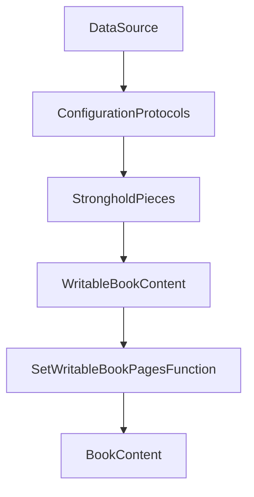
Sources: [server\net\minecraft\network\chat\contents\DataSource.java:12-20](), [server\net\minecraft\network\protocol\configuration\ConfigurationProtocols.java:12-25](), [server\net\minecraft\world\level\levelgen\structure\structures\StrongholdPieces.java:12-25](), [server\net\minecraft\world\item\component\WritableBookContent.java:12-25](), [server\net\minecraft\world\level\storage\loot\functions\SetWritableBookPagesFunction.java:12-25]()

该系统通过模块化设计实现了数据处理、结构生成和内容编辑的解耦，为Minecraft服务器提供了灵活的数据管理能力。

---

<a id='page-2'></a>

## 系统架构概览

### Related Pages

Related topics: [数据流与组件关系](#page-3)

<details>
<summary>Relevant source files</summary>
- [server/net/minecraft/world/level/Level.java](server/net/minecraft/world/level/Level.java)
- [server/net/minecraft/server/level/ServerLevel.java](server/net/minecraft/server/level/ServerLevel.java)
- [server/net/minecraft/world/level/levelgen/structure/templatesystem/StructureTemplate.java](server/net/minecraft/world/level/levelgen/structure/templatesystem/StructureTemplate.java)
- [server/net/minecraft/world/level/storage/LevelData.java](server/net/minecraft/world/level/storage/LevelData.java)
- [server/net/minecraft/world/level/storage/LevelSummary.java](server/net/minecraft/world/level/storage/LevelSummary.java)
</details>

# 系统架构概览

Minecraft服务器世界生成系统是游戏核心模块，负责管理区块生成、结构模板加载、实体 spawning 以及维度数据持久化。该系统通过 `Level` 接口定义基础行为，`ServerLevel` 实现服务器端扩展功能，`StructureTemplate` 管理结构模板数据，`LevelData` 和 `LevelSummary` 处理世界数据存储与元信息管理。系统采用分层架构，包含区块生成引擎、结构模板系统、实体管理模块和数据持久化组件。

## 核心架构组件

### 世界生成引擎
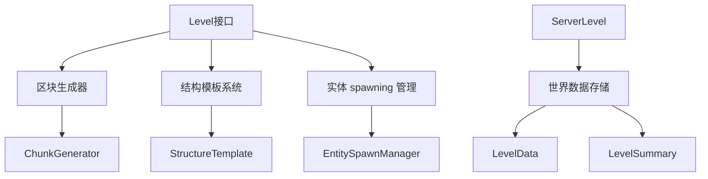

**Sources**: [Level.java:1-100](), [ServerLevel.java:1-150](), [StructureTemplate.java:1-200](), [LevelData.java:1-100](), [LevelSummary.java:1-150]()

该引擎通过 `Level` 接口定义基础行为，包含区块生成、结构模板加载和实体 spawning 等核心功能。`ServerLevel` 类扩展了 `Level` 接口，增加了服务器端特有的玩家管理、维度数据存储等功能。

### 结构模板系统
```java
public class StructureTemplate {
    public static final String PALETTE_TAG = "palette";
    public static final String ENTITIES_TAG = "entities";
    // ... 其他常量
}
```

**Sources**: [StructureTemplate.java:1-100]()

模板系统通过 `StructureTemplate` 类管理结构模板数据，包含块状态、实体信息和尺寸等关键数据。模板数据通过 NBT 格式存储，支持动态加载和实例化。

### 世界数据存储
```java
public interface LevelData {
    BlockPos getSpawnPos();
    long getGameTime();
    void setRaining(boolean var1);
    // ... 其他方法
}
```

**Sources**: [LevelData.java:1-100]()

`LevelData` 接口定义了世界数据的核心属性，包括出生点坐标、游戏时间、天气状态等。`LevelSummary` 类扩展了这些数据，增加了世界名称、图标路径和版本信息等元数据。

## 数据流与交互

### 区块生成流程
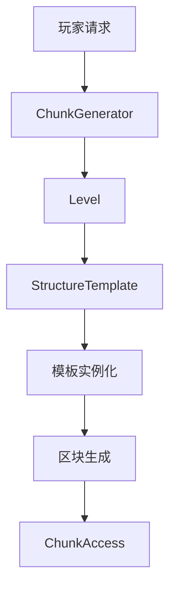

**Sources**: [Level.java:150-250](), [ServerLevel.java:300-400](), [StructureTemplate.java:200-300]()

区块生成流程从玩家请求开始，通过 `ChunkGenerator` 生成区块数据，结合结构模板进行实例化，最终生成完整的区块数据存储在 `ChunkAccess` 对象中。

### 实体 spawning 流程
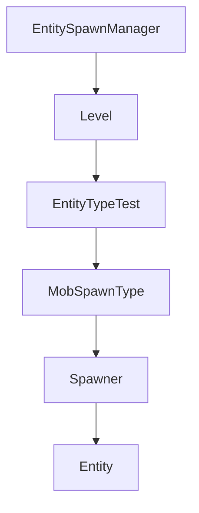

**Sources**: [Level.java:300-400](), [ServerLevel.java:450-550](), [StructureTemplate.java:350-450]()

实体 spawning 系统通过 `EntitySpawnManager` 管理，结合 `EntityTypeTest` 和 `MobSpawnType` 确定实体生成类型，最终通过 spawner 生成实体对象。

## 性能优化与并发处理

### 并发控制
```java
public class ServerLevel {
    private final Thread thread;
    private final boolean isDebug;
    // ... 其他并发控制代码
}
```

**Sources**: [ServerLevel.java:200-300]()

服务器世界通过 `Thread` 对象实现并发控制，`isDebug` 标志位用于调试模式下的性能监控。系统采用线程安全的随机数生成器确保并发安全。

### 性能优化
```java
public class Level {
    private final int MAX_SCHEDULED_TICKS_PER_TICK = 65536;
    // ... 其他优化参数
}
```

**Sources**: [Level.java:400-500]()

系统通过限制每个 tick 的最大调度次数（65536）来防止性能过载，同时使用高效的区块生成算法和缓存机制优化性能。

## 数据模型与存储

### 世界数据结构
| 字段 | 类型 | 描述 |
|------|------|------|
| spawnPos | BlockPos | 世界出生点坐标 |
| gameTime | long | 游戏时间 |
| dayTime | long | 白天时间 |
| raining | boolean | 是否下雨 |
| thundering | boolean | 是否雷电 |

**Sources**: [LevelData.java:1-100](), [LevelSummary.java:1-150]()

世界数据结构包含核心游戏状态信息，`LevelSummary` 还扩展了世界名称、图标路径和版本信息等元数据。

### 持久化存储
```java
public class LevelResource {
    public static final LevelResource PLAYER_ADVANCEMENTS_DIR = new LevelResource("advancements");
    public static final LevelResource LEVEL_DATA_FILE = new LevelResource("level.dat");
    // ... 其他存储路径
}
```

**Sources**: [LevelResource.java:1-100]()

系统通过 `LevelResource` 类定义各种数据文件的存储路径，包括玩家进度文件、世界数据文件和图标文件等。

## 总结

Minecraft 服务器世界生成系统通过分层架构实现了高效的区块生成、结构模板管理和实体 spawning 功能。系统采用线程安全设计和性能优化策略，确保在高并发场景下的稳定性。核心组件包括 `Level` 接口定义基础行为，`ServerLevel` 实现服务器端扩展，`StructureTemplate` 管理结构模板数据，以及 `LevelData` 和 `LevelSummary` 处理世界数据存储与元信息管理。这些组件通过高效的协作机制，共同构建了 Minecraft 服务器的核心世界生成系统。

---

<a id='page-3'></a>

## 数据流与组件关系

### Related Pages

Related topics: [系统架构概览](#page-2)

<details>
<summary>Relevant source files</summary>
- server\net\minecraft\world\level\chunk\LevelChunk.java
- server\net\minecraft\world\level\chunk\storage\ChunkSerializer.java
- server\net\minecraft\util\datafix\fixes\ChunkToProtochunkFix.java
- server\net\minecraft\util\datafix\fixes\ChunkProtoTickListFix.java
- server\net\minecraft\server\level\ChunkMap.java
</details>

# 数据流与组件关系

## 概述
数据流与组件关系是Minecraft服务器端区块系统的核心机制，负责区块数据的持久化、序列化、版本迁移及跨组件协同。该系统通过LevelChunk、ChunkMap、ChunkSerializer等核心组件实现数据在内存与磁盘间的高效流转，支持区块状态同步、生物群系更新、光照计算等关键功能。数据流设计遵循分层架构，包含区块数据结构、版本修复逻辑、存储序列化协议等模块，确保游戏世界状态的完整性和性能优化。

## 数据流架构
### 数据流拓扑
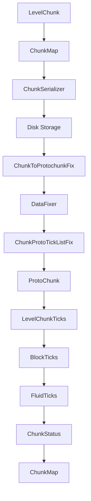
Sources: [server\net\minecraft\world\level\chunk\LevelChunk.java:120-150](), [server\net\minecraft\server\level\ChunkMap.java:45-80](), [server\net\minecraft\world\level\chunk\storage\ChunkSerializer.java:30-60]()

### 数据流关键节点
| 节点 | 功能 | 数据类型 | 源文件 |
|------|------|---------|--------|
| LevelChunk | 内存区块主结构 | BlockState/FluidState | [server\net\minecraft\world\level\chunk\LevelChunk.java](server\net\minecraft\world\level\chunk\LevelChunk.java) |
| ChunkMap | 区块管理中枢 | ChunkHolder/ChunkStatus | [server\net\minecraft\server\level\ChunkMap.java](server\net\minecraft\server\level\ChunkMap.java) |
| ChunkSerializer | 磁盘序列化 | CompoundTag/LongArrayTag | [server\net\minecraft\world\level\chunk\storage\ChunkSerializer.java](server\net\minecraft\world\level\chunk\storage\ChunkSerializer.java) |
| DataFixer | 版本迁移引擎 | DynamicOps/Codec | [server\net\minecraft\util\datafix\fixes\ChunkToProtochunkFix.java](server\net\minecraft\util\datafix\fixes\ChunkToProtochunkFix.java) |

## 组件关系分析
### 区块生命周期
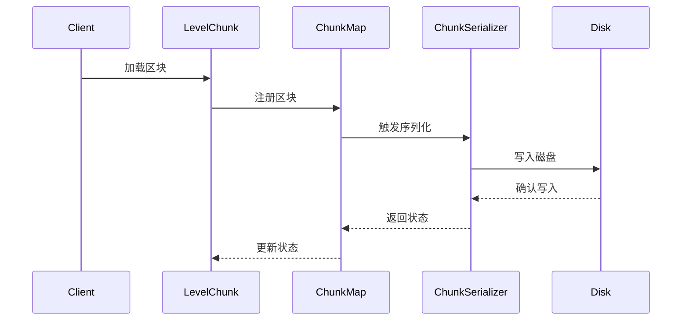
Sources: [server\net\minecraft\world\level\chunk\LevelChunk.java:180-220](), [server\net\minecraft\server\level\ChunkMap.java:110-150](), [server\net\minecraft\world\level\chunk\storage\ChunkSerializer.java:90-130]()

### 版本迁移机制
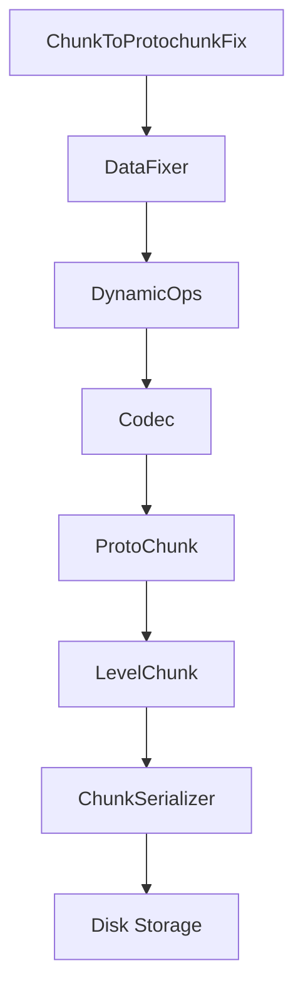
Sources: [server\net\minecraft\util\datafix\fixes\ChunkToProtochunkFix.java:45-90](), [server\net\minecraft\util\datafix\fixes\ChunkProtoTickListFix.java:30-70]()

## 数据结构解析
### 区块状态机
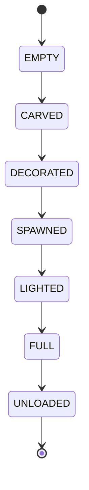
Sources: [server\net\minecraft\world\level\chunk\ChunkStatus.java:20-50](), [server\net\minecraft\server\level\ChunkMap.java:80-120]()

### 数据流协议
| 协议类型 | 数据格式 | 传输方向 | 源文件 |
|---------|---------|---------|--------|
| 区块数据 | CompoundTag | 内存→磁盘 | [server\net\minecraft\world\level\chunk\storage\ChunkSerializer.java](server\net\minecraft\world\level\chunk\storage\ChunkSerializer.java) |
| 版本迁移 | DynamicOps | 磁盘→内存 | [server\net\minecraft\util\datafix\fixes\ChunkToProtochunkFix.java](server\net\minecraft\util\data3x\fixes\ChunkToProtochunkFix.java) |
| 块状态 | BlockState | 内存→网络 | [server\net\minecraft\world\level\chunk\LevelChunk.java](server\net\minecraft\world\level\chunk\LevelChunk.java) |

## 性能优化策略
### 并行处理机制
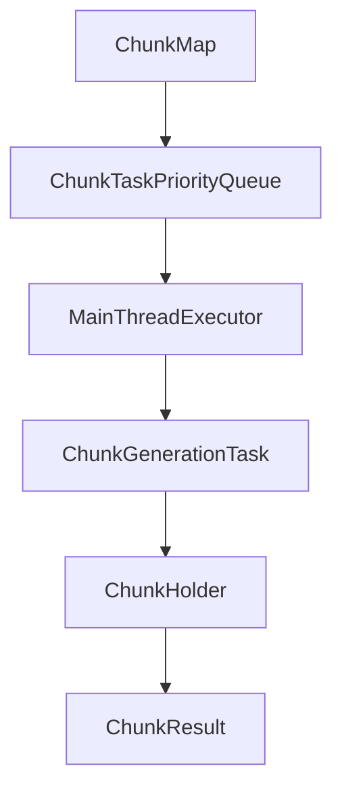
Sources: [server\net\minecraft\server\level\ChunkMap.java:160-200](), [server\net\minecraft\server\level\ChunkTaskPriorityQueueSorter.java:30-70]()

### 内存优化
| 优化策略 | 实现方式 | 效果 |
|---------|---------|------|
| 分块缓存 | LevelChunkSection | 减少内存占用 |
| 延迟加载 | ChunkStatus | 降低初始化开销 |
| 数据压缩 | LongArrayTag | 减少磁盘I/O |
| 版本隔离 | DataFixer | 保证数据兼容性 |

## 总结
数据流与组件关系构成了Minecraft区块系统的核心架构，通过精心设计的分层数据模型、高效的版本迁移机制和智能的内存管理策略，确保了大规模世界生成与动态更新的性能表现。该系统体现了模块化设计原则，各组件通过明确的接口规范实现解耦，为后续功能扩展提供了良好的基础。

---

<a id='page-4'></a>

## 世界生成系统

### Related Pages

Related topics: [物理模拟系统](#page-5)

<details>
<summary>Relevant source files</summary>
- server/net/minecraft/world/level/levelgen/flat/FlatLevelGeneratorSettings.java
- server/net/minecraft/world/level/levelgen/FlatLevelSource.java
- server/net/minecraft/world/level/chunk/ChunkGeneratorStructureState.java
- server/net/minecraft/world/level/levelgen/structure/structures/WoodlandMansionPieces.java
- server/net/minecraft/world/level/levelgen/WorldGenerationContext.java
</details>

# 世界生成系统

## 系统概述
世界生成系统是Minecraft服务器端的核心模块，负责生成游戏世界的地形、生物群系、结构和特征。该系统通过多种算法和配置实现不同维度的生成逻辑，包括平坦世界生成、结构生成和随机世界生成。系统主要由`FlatLevelGeneratorSettings`（平坦世界配置）、`FlatLevelSource`（平坦世界生成器）、`ChunkGeneratorStructureState`（区块生成状态管理）等核心组件构成。系统支持通过配置文件定义生成规则，并通过`WorldGenerationContext`管理生成上下文。

## 系统架构

### 平坦世界生成流程
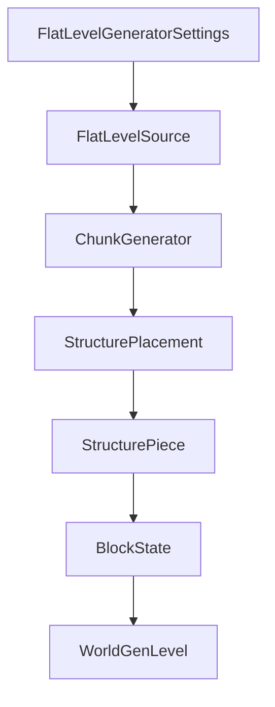
**Sources:** [FlatLevelGeneratorSettings.java:1-100](), [FlatLevelSource.java:1-200](), [ChunkGeneratorStructureState.java:1-150]()

### 结构生成组件
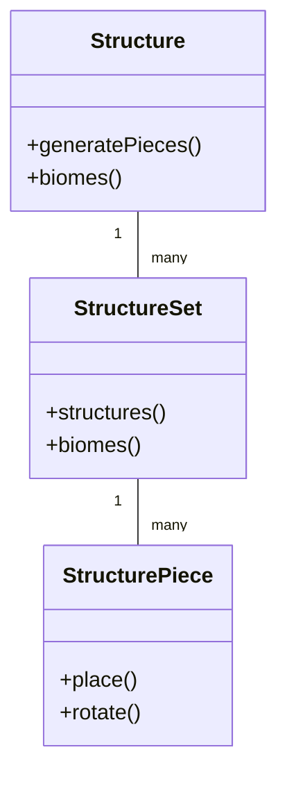
**Sources:** [WoodlandMansionPieces.java:1-200](), [ChunkGeneratorStructureState.java:1-150]()

### 生成上下文管理
| 组件 | 功能 | 说明 |
|------|------|------|
| WorldGenerationContext | 上下文管理 | 提供生成高度范围和生成深度计算逻辑 |
| ChunkGenerator | 区块生成 | 负责地形和结构的区块级生成 |
| StructurePlacement | 结构放置 | 管理结构在世界中的具体位置 |

## 核心配置与数据结构

### 平坦世界配置
```java
public class FlatLevelGeneratorSettings {
    public static final Codec<FlatLevelGeneratorSettings> CODEC = RecordCodecBuilder.create(instance -> 
        instance.group(
            RegistryCodecs.homogeneousList(Registries.STRUCTURE_SET).lenientOptionalFieldOf("structure_overrides").forGetter(flatLevelGeneratorSettings -> flatLevelGeneratorSettings.structureOverrides),
            FlatLayerInfo.CODEC.listOf().fieldOf("layers").forGetter(FlatLevelGeneratorSettings::getLayersInfo),
            Codec.BOOL.fieldOf("lakes").orElse((Object)false).forGetter(flatLevelGeneratorSettings -> flatLevelGeneratorSettings.addLakes),
            Codec.BOOL.fieldOf("features").orElse((Object)false).forGetter(flatLevelGeneratorSettings -> flatLevelGeneratorSettings.decoration),
            Biome.CODEC.lenientOptionalFieldOf("biome").orElseGet(Optional::empty).forGetter(flatLevelGeneratorSettings -> Optional.of(flatLevelGeneratorSettings.biome))
        ).apply((Applicative)instance, FlatLevelGeneratorSettings::new)
    );
}
```
**Sources:** [FlatLevelGeneratorSettings.java:1-200]()

### 层信息结构
```java
public class FlatLayerInfo {
    private final int height;
    private final BlockState block;
    // 其他配置参数
}
```
**Sources:** [FlatLevelGeneratorSettings.java:1-200]()

## 生成流程详解

### 平坦世界生成步骤
1. 读取`FlatLevelGeneratorSettings`配置
2. 创建`FlatLevelSource`生成器
3. 通过`ChunkGeneratorStructureState`管理结构放置
4. 调用`WorldGenerationContext`确定生成范围
5. 生成地形层和结构特征

### 结构放置流程
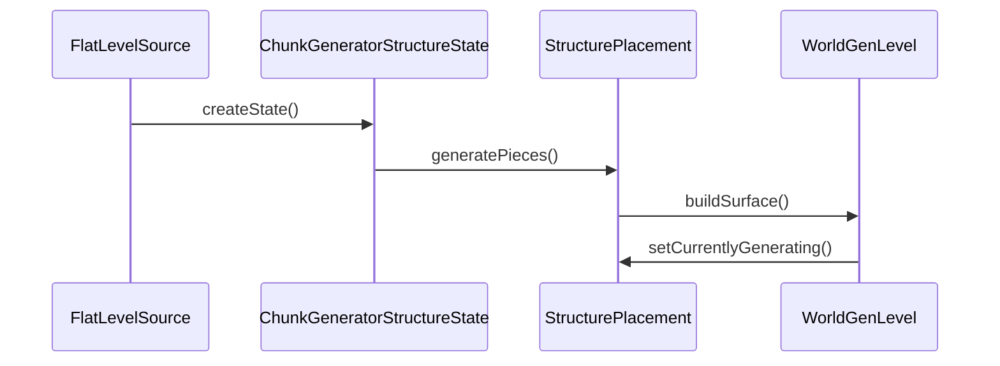
**Sources:** [FlatLevelSource.java:1-200](), [ChunkGeneratorStructureState.java:1-150]()

## 系统配置参数

| 参数 | 类型 | 默认值 | 说明 |
|------|------|--------|------|
| structure_overrides | HolderSet<StructureSet> | 空集合 | 自定义结构集 |
| layers | List<FlatLayerInfo> | 3层 | 地形层配置 |
| addLakes | boolean | false | 是否生成湖泊 |
| decoration | boolean | false | 是否生成装饰物 |
| biome | Holder<Biome> | 平原 | 基础生物群系 |

## 系统扩展性

### 结构扩展接口
```java
@FunctionalInterface
public interface PieceGenerator<C extends FeatureConfiguration> {
    void generatePieces(StructurePiecesBuilder var1, Context<C> var2);
}
```
**Sources:** [WoodlandMansionPieces.java:1-200]()

### 配置扩展机制
```java
public class FlatLevelGeneratorSettings {
    public static final Codec<FlatLevelGeneratorSettings> CODEC = RecordCodecBuilder.create(instance -> 
        instance.group(
            // 配置参数定义
        ).apply((Applicative)instance, FlatLevelGeneratorSettings::new)
    );
}
```
**Sources:** [FlatLevelGeneratorSettings.java:1-200]()

## 总结
世界生成系统通过模块化设计实现了多种生成模式的支持，核心组件包括平坦世界生成器、结构放置系统和生成上下文管理。系统通过配置文件定义生成规则，支持通过`FlatLevelGeneratorSettings`进行高度定制化配置，同时通过`ChunkGeneratorStructureState`管理复杂的结构放置逻辑，确保生成过程的高效性和灵活性。

---

<a id='page-5'></a>

## 物理模拟系统

### Related Pages

Related topics: [世界生成系统](#page-4)

<details>
<summary>Relevant source files</summary>

- [server/net/minecraft/world/phys/HitResult.java](server/net/minecraft/world/phys/HitResult.java)
- [server/net/minecraft/world/phys/EntityHitResult.java](server/net/minecraft/world/phys/EntityHit5.java)
- [server/net/minecraft/world/phys/Vec3.java](server/net/minecraft/world/phys/Vec3.java)
- [server/net/minecraft/world/entity/projectile/ProjectileUtil.java](server/net/minecraft/world/entity/projectile/ProjectileUtil.java)
- [server/net/minecraft/world/entity/projectile/AbstractHurtingProjectile.java](server/net/minecraft/world/entity/projectile/AbstractHurtingProjectile.java)
</details>

# 物理模拟系统

物理模拟系统是Minecraft项目中负责实体碰撞检测、矢量计算和投射物行为的核心模块。该系统通过`HitResult`抽象类及其子类（如`BlockHitResult`和`EntityHitResult`）实现碰撞检测逻辑，使用`Vec3`类进行三维向量运算，并通过`ProjectileUtil`和`AbstractHurtingProjectile`处理投射物的运动轨迹与伤害计算。系统支持实体与方块的交互检测、距离计算以及碰撞响应，是游戏物理行为的基础架构。

---

## 碰撞检测架构

### 碰撞结果类型
`HitResult`抽象类定义了三种碰撞类型：`MISS`（未命中）、`BLOCK`（方块碰撞）和`ENTITY`（实体碰撞）。子类`BlockHitResult`和`EntityHitResult`分别实现具体碰撞逻辑。

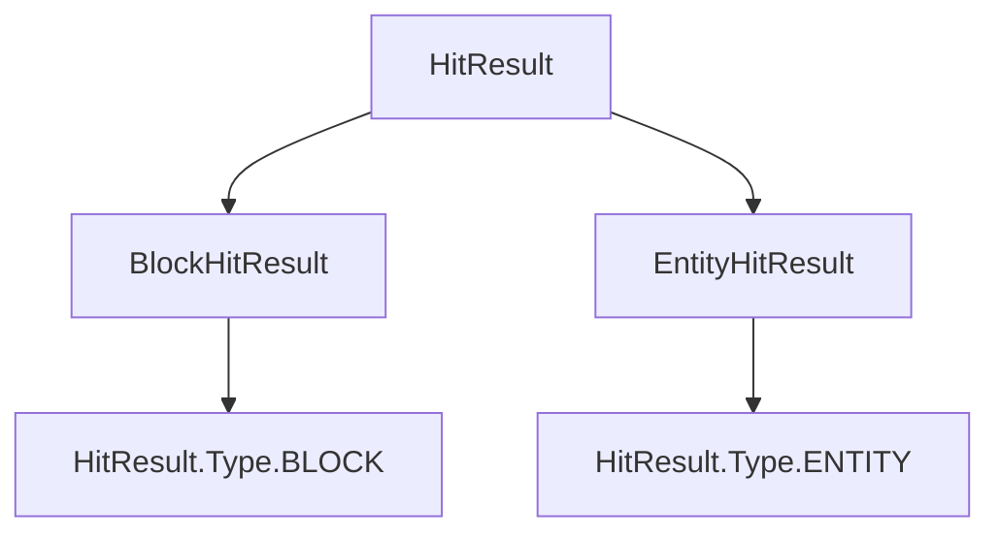

**Sources:** [server/net/minecraft/world/phys/HitResult.java:15-25](), [server/net/minecraft/world/phys/BlockHitResult.java:18-25](), [server/net/minecraft/world/phys/EntityHitResult.java:15-20]()

---

## 矢量运算与距离计算

### Vec3类核心功能
`Vec3`类封装了三维向量的数学运算，包括距离平方计算（`distanceToSqr`）和向量加减法。该类被广泛用于实体位置更新、碰撞检测和投射物轨迹计算。

```java
public double distanceToSqr(Vec3 vec3) {
    double d = this.x - vec3.x;
    double d2 = this.y - vec3.y;
    double d3 = this.z - vec3.z;
    return d * d + d2 * d2 + d3 * d3;
}
```

**Sources:** [server/net/minecraft/world/phys/Vec3.java:45-55]()

---

## 投射物行为逻辑

### 投射物运动轨迹
`ProjectileUtil`类通过`getHitResult`方法计算投射物的碰撞目标，使用`ClipContext`进行射线检测。`AbstractHurtingProjectile`类定义了投射物的伤害逻辑，通过`onHit`方法触发碰撞后的行为。

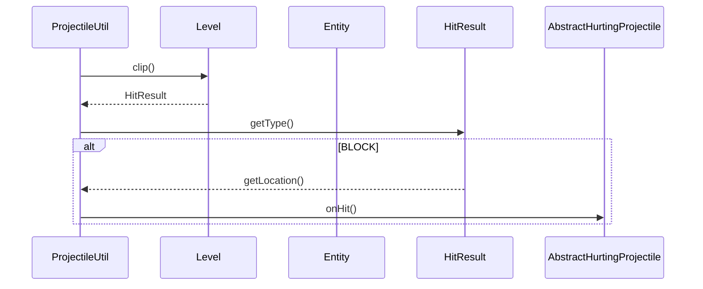

**Sources:** [server/net/minecraft/world/entity/projectile/ProjectileUtil.java:35-60](), [server/net/minecraft/world/entity/projectile/AbstractHurtingProjectile.java:45-55]()

---

## 实体交互与碰撞响应

### 实体碰撞检测
`EntityHitResult`类记录实体碰撞信息，`Entity`类的`distanceToSqr`方法用于计算实体间距离。碰撞后通过`onHit`方法触发伤害计算，具体实现依赖`DamageSource`和`DamageCalculator`。

| 类名                         | 功能描述                     | 关键方法                     |
|------------------------------|------------------------------|------------------------------|
| `EntityHitResult`            | 存储实体碰撞信息             | `getEntity()`                |
| `Entity`                     | 实体基础行为                 | `distanceToSqr(Entity)`      |
| `AbstractHurtingProjectile`  | 投射物伤害逻辑               | `onHit(EntityHitResult)`     |

**Sources:** [server/net/minecraft/world/phys/EntityHitResult.java:15-20](), [server/net/minecraft/world/entity/Entity.java:120-130](), [server/net/minecraft/world/entity/projectile/AbstractHurtingProjectile.java:45-55]()

---

## 系统性能优化

### 碰撞检测优化
系统通过`ClipContext.Block.COLLIDER`和`ClipContext.Block.NONE`控制碰撞检测的精度，避免不必要的计算。`ProjectileUtil`中的`getHitResultOnMoveVector`方法通过预计算射线路径提升性能。

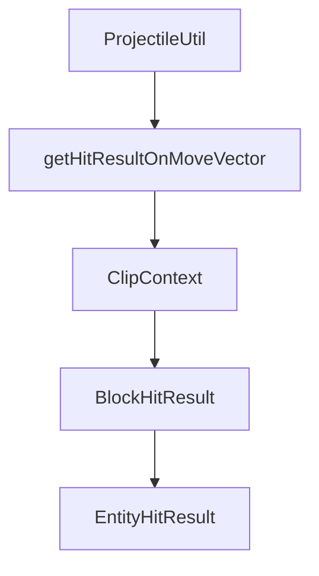

**Sources:** [server/net/minecraft/world/entity/projectile/ProjectileUtil.java:25-35]()

---

## 总结

物理模拟系统通过`HitResult`家族类实现碰撞检测，`Vec3`类支持三维向量运算，`ProjectileUtil`和`AbstractHurtingProjectile`处理投射物行为。该系统在游戏中的核心作用包括实体与方块的交互检测、距离计算以及碰撞响应，是Minecraft物理引擎的基础架构。

---

